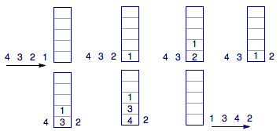
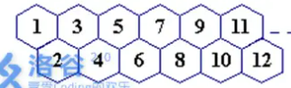
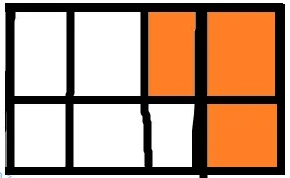

# 1-4 递推和递归总结

## P1255	数楼梯

题目：楼梯有 N 阶, 上楼可以一步上一阶, 也可以一步上二阶, 求不同走法的方案数。

思路： $f[n] = f[n-1] + f[n-2]$

## P1002	\[NOIP2002 普及组\] 过河卒

题目：棋盘上 A 点有一个卒要走到 B 点, 只能往下或往右走, 有一些点不能走, 求可能的方案数。

思路： $f[x, y] = f[x-1][y] + f[x][y-1]$

## P1044	\[NOIP2003 普及组\] 栈

题目：给定 1, 2, ..., n 求经过栈的 push 和 pop 操作后能有多少种输出方案。

思路：这是一道经典题, 有多种做法。

### 1. 记忆化搜索

- 设 $f[i,j]$ 表示还有 i 个数没处理、有 j 个数在栈里的方案数, 起始状态为 $f[n,0]$。
- 如果数全都进栈了, 那只有唯一的方案, 所以边界 $f[0,j]=1$
- 对 $f[i,j]$ 有两种情况, 栈此时是空的, 或栈此时是非空的
  - 若栈此时是空的, 则只能入栈 1 个元素, 方案数 $f[i,j] = f[i-1, j+1]$
  - 若栈是非空的, 则可以出栈 1 个元素, 或者入栈 1 个元素, 方案数 $f[i,j] = f[i, j-1] + f[i-1, j+1]$

### 2. 动态规划

- 记忆化搜索从 $f[n,0]$ 出发, 把大问题划归为小问题。动态规划从 $f[0,0...N]$ 出发, 从小问题的解组成大问题的解。
- 转移方程不变

```python
for i in range(1, N + 1):
    f[i][0] = f[i - 1][1]
    for j in range(1, N - i + 1):
        f[i][j] = f[i - 1][j + 1] + f[i][j - 1]
print(f[N][0])
```

### 3 卡特兰数

[Leetcode 对卡特兰数的介绍](https://leetcode.cn/circle/discuss/lWYCzv/)

[math173 对卡特兰数的介绍](http://lanqi.org/skills/10939/)

[wiki 对卡特兰数的介绍](https://en.wikipedia.org/wiki/Catalan_number)

首先, 每一种出栈序列都与一一对应进出栈的顺序。不妨用 +1 表示进栈, -1 表示出栈, 那么出栈序列 (2, 4, 3, 1) 与进出栈顺序 (+1, +1, -1, +1, +1, -1, -1, -1) 是对应的。



那么对 n 个数的序列, 总的进出栈顺序是给 2n 个 1 前面挑 n 个添加 $+$ 号, 其他的添加 $-$ 号, 共 $C^n_{2n}$ 种吗？

答案是否定的, 这是因为出栈的前提是有进栈动作, 于是要求每个排列中的前若干项和均不为负数, 也就是说排列

1, -1, -1, 1, 1, -1, -1, 1

是无效的。那么无效的排列到底有多少呢？设 M 是所有无效的排列构成的集合, 直接求 M 的数量不好求。

考虑其中第一次发现排列无效的时候, 也就是第一次发现其前若干项和为 -1 的时候, 此时我们将包含使得前若干项和为 -1 的这一项开始的之前的所有项全都取相反数, 那么就会得到一个新的排列, 这个排列包含 n+1 个 +1 以及 n-1 个 -1, 设所有这样的排列构成集合 N．

可证明 $M \to N$ 的映射是双射 (N 中的每一个排列从第一项往后累积求和的时候必然会出现和为 +1 的情形, 此时将排列中使得和为 +1 的这一项连同之前的所有项全部取相反数, 那么就会得到 M 中的一个排列)．

这样, 无效的排列可以通过 N 求出, 共有 $C_{2n}^{n-1}$ 个, 总的出栈序列方案数为 

$$C_{2n}^{n}-C_{2n}^{n-1}=\frac{C_{2n}^{n}}{n+1}$$

也可以从递归定义出发。令 $f[n]$ 为 n 个数出入栈的方法数。若首个入栈数字第 k 个出栈，可得 $f[n] += f[k-1]*f[n-k]$，其中前项表示首个入栈数字从出栈到入栈之间的数字出入栈的方法数，后项表示首个入栈数字出栈后的剩余数字出入栈的方法数。所以可得

$$f[n] = f[0] * f[n-1] + f[1] * f[n-2] + \cdots + f[n-1] * f[0] = \sum_{i=0}^{n-1} f[i] * f[n-i]$$

这正是卡特兰数公式的递归形式。

进出栈问题还有很多变形, 如

1. 匹配的括号序列种数
2. n+1 个叶子节点能够构成多少种形状不同的国际满二叉树
3. 不跨越对角线, 只能向右和向下的方格地图移动方案数
4. 电影购票找零方案数（-1 和 1 不相等的情况！）
5. 圆内连弦方案数（Leetcode 1259 不相交的握手）
6. 节点值从 1 到 n 互不相同的二叉搜索树有多少种
7. 使用 n 个矩形拼成 n 阶梯形

详见

[卡特兰数问题集 1](https://zhuanlan.zhihu.com/p/31317307)

[卡特兰数问题集 2](https://zhuanlan.zhihu.com/p/31526354)

[卡特兰数问题集 3](https://zhuanlan.zhihu.com/p/31585260)

卡特兰数问题中都会存在一种匹配关系, 如进出栈匹配, 括号匹配等, 一旦计数问题中存在这种关系, 那我们就需要去考虑这是否是卡特兰数问题。此外, 我们还可以记住序列前四项：1, 1, 2, 5, 这些将有利于我们联想到卡特兰数。

卡特兰数有多种定义方式

- 递归定义
 
$$
\begin{cases}
  C_0 = C_1 =1 \\
  C_n = \sum_{k=0}^{n-1} C_kC_{n-1-k} = C_0C_{n-1}+C_1C_{n-2}+\ldots+C_{n-1}C_0, n\geq 2
\end{cases}
$$

- 递推公式

$$C_n=\frac{4n-2}{n+1}C_{n-1}$$

- 通项公式 （通过第一个公式 + 卢卡斯定理获得卡特兰数取模的值）

$$C_n=\frac{1}{n+1}C_{2n}^n=C_{2n}^n-C_{2n}^{n-1}$$

$$C_n=\frac{1}{n+1}\sum_{i=0}^n\left(C_n^i\right)^2$$

- 增长速度

$$\Delta C_n\sim\frac{4^n}{n^{\frac32}\sqrt{\pi}}$$


## P1028	\[NOIP2001 普及组\] 数的计算

题目：构造数列, 求合法数列方案数

思路： $f[num]=f[1\ldots num//2] + 1$

## P1464	Function

题目：给定递归方式, 求解答案

思路：记忆化搜索

## P1928	外星密码

要求对字符串解压缩, 如 AC[3FUN] 解压为 ACFUNFUNFUN, 可能有多重压缩。

### 思路1. 纯模拟: 

我们需要操作的对象是方括号内的部分, 对于方括号外面的内容不需要进行任何的操作. 因此要找到最内层的括号并进行处理.

怎么找最内层的括号呢? 方法是从字符串末尾开始找第一个左括号, 然后从此往右找第一个右括号. 确定最内层括号后, 使用 `string.replace()` 把字符串进行替换, 这样一直重复直到没有括号为止, 就得到了最终的答案。

```python
def unzip(s):
    s = s.strip("[]")
    digit = 0
    for t in s:
        if "0" <= t and t <= "9":
            digit += 1
        else:
            break
    num = int(s[:digit])
    residualS = s[digit:]
    return residualS * num

str = input()
while True:
    try:
        left = str.rindex("[")
        right = str.index("]", left)
    except:
        break
    zipString = str[left : right + 1]
    str = str.replace(zipString, unzip(zipString))
print(str)
```

### 思路2. 递归: 

对于 C++ 语言, 递归比较方便, 因为读入数据是按字符读入.

```C++
string read(){
	int n; char c; string s="", s1;
	
  //一直读入字符, 直到Ctrl+z
	while (cin>>c){
		if (c=='['){
			cin>>n;//读入D
			s1=read();//读入X
			while (n--) s+=s1;//重复D次X
		}
		else{
			if (c==']') return s;//返回X
		  else s+=c;//如果不是'['和']', 那就是X的一个字符, 所以加进X
		}
	}
  return s;
}
int main() {cout<<read(); return 0;}
```

python 由于按行读入, 所以可以先读入整行, 然后把 `cin()` 实现为 `return s[i++]` , 对数字的读入也需要单独处理, 其他思路与 C++ 相同.

```python
str = input()
index, strLen = 0, len(str)

def getInput():
    global index
    if index < strLen:
        t = str[index]
        index += 1
        return t
    else:
        return "-1"

def getNumber():
    global index
    num = 0
    while "0" <= str[index] and str[index] <= "9" and index < strLen:
        num = (num << 3) + (num << 1) + int(str[index])
        index += 1
    return num

def unzip():
    ch = getInput()
    s = ""
    while ch != "-1":
        if ch == "]":
            return s
        elif ch == "[":
            mul = getNumber()
            tmpStr = unzip()
            s += tmpStr * mul
        else:
            s += ch
        ch = getInput()
    return s

print(unzip())
```
经测试两种方法速度差不多

## P2437	蜜蜂路线



思路: 数 n-m+1 个楼梯

## P1164	小A点菜

口袋里有 M 元, 有 N 种菜, 每种菜 ai 元, 求刚好花完钱的点菜方法

思路: 01背包. 设 $f[i][j]$ 表示前 i 种菜花了 j 元的点菜方法, 转移方程如下.

$$
f[i][j] = 
\begin{cases}
  f[i-1][j], j < cost[i] \\
  f[i-1][j]+1, j = cost[i] \\
  f[i-1][j]+f[i-1][j-cost[i]], j > cost[i]
\end{cases}
$$

如果边界条件设为 $f[i][0] = 1$, 那么 $j \geq cost[i]$ 可以合并为一种情况.

## P1036	\[NOIP2002 普及组\] 选数

在 1-3 中已经解决

## P1990	覆盖墙壁

有个长为 N 宽为 2 的墙壁, 现在要用两种砖头覆盖这面墙壁. 一种长 2 宽 1, 另一种是 面积为 3 的 L 形, 求方案数.

### 思路 1

设 $f[N]$ 表示铺满前 Nx2 的面积的墙的方案数. 

a. 当墙的最后一列被 1x2 砖铺满时, 以这种状态结尾的方案数为 $f[N-1]$

b. 当墙的最后两列被两个 1x2 砖打横铺满时, 以这种状态结尾的方案数为 $f[N-2]$

c. 当墙的最后两列被一个 L 填时, 会有一个空, 形状如下所示:



设 $g[N]$ 表示前 N 列已经填满, 第 N+1 列填了有一个空, 这种情况可以记为 $g[N-2]$ 由于 L 形砖块可上下翻转, 所以这种情况要算两次.

所以 $f[N] = f[N-1] + f[N-2] + 2g[N-2]$, 如何维护 g 数组?

1. 再使用一个 L 形砖块, 变成 $f[N-3]$
        
2. 使用一个 2x1 砖块打横填, 变成 $g[N-3]$


    所以 $g[N]=g[N-1]+g[N-1]$.

d. 边界条件 $f[0]=f[1]=1$, $g[0]=0$, $g[1]=1$


### 思路 2

不设另外的 g 数组, 对于情况 3 已经放了一个 L 型砖块, 我们考虑以下情况:

1. 再放一个 L 型砖块, 恰好消去突出, 方案数 $f[N-3]$
2. 横放一个 2x1 砖块 再放一个 L 型砖块, 方案数 $f[N-4]$
3. 事实上 2x1 砖块可以交替放置, 最后放 L 型砖块填满墙壁. 因此情况 3 的方案数为 $2\times (f[n-3]+f[n-4]+\ldots+f[0])$

因此总的方案数为

$$F_n=\left(\sum_{i=0}^{n-1}F_i\right)+\left(\sum_{i=0}^{n-3}F_i\right)$$

## P3612	\[USACO17JAN\] Secret Cow Code S

给定一个字符串和无限旋转方法, 求旋转后的第 i 位的字符.

旋转方法: COW -> COWWCO -> COWWCOOCOWWC ...

### 思路

通过观察我们可以发现, 每一次增长增长的部分的第一位跟原部分的最后一位相同, 增长部分的第二位到最后一位跟原部分的第一位到倒数第二位相同. 所以可以考虑分治.

首先要找到字符串什么时候长度超过 N, 可以维护一个变量 t.

`while (t < n) t <<= 1;`

当第 N 个字符在长度为 t 的字符串后半段时, 前半段有一个字符与它相同, 即 `str[N-(1+t/2)]=str[N]`, 同时还要特判翻转后的第一个字符. 当第 N 个字符在长度为 t 的字符串前半段时, 对 N 不需要处理.

```c++
while (t != len) {
	t >>= 1;
    if (n <= t) continue;
	if (n == t + 1) n = t;
	else n -= 1 + t;
}
```

## P1259	黑白棋子的移动

有 2n 个棋子排成一行, 开始位置白子全部在左边, 黑子全部在右边, 如下图为 n=5 的情况


移动棋子的规则是: 每次必须同时移动相邻的两个棋子, 颜色不限, 可以左移也可以右移到空位上去, 但不能调换两个棋子的左右位置。每次移动必须跳过若干个棋子 (不能平移) , 要求最后能移成黑白相间的一行棋子。如 n=5 时, 成为：


### 思路

题目数据范围给到 $4\leq n\leq 100$, 经过分析可得, 当 $n\geq 4$ 时, 可以先将中间两个白黑棋子交换到右边空地, 然后把右边两个黑棋子交换到中间空地. 这样就将 n 分治为 n-1. 当 n=3 时, 不能再分治, 特判即可解决.

## P1010	\[NOIP1998 普及组\] 幂次方

将任意正整数 n ($n\leq 2\times 10^4$) 表示为 2 的幂次方, 同时把各次幂也表示为 2 的幂次方. 

约定 $a^b$ 表示为 $a(b)$

例如 $137=2^{7}+2^{3}+2^{0}$. 而 $7=2^{2}+2+2^{0}$, $3$ 同理, 故最后 137 可以表示为 $2(2(2)+2+2(0)) + 2(2+2(0)) + 2(0)$

### 思路

一道典型分治题, 难点在于如何处理括号.

首先分析可得, 当 n 为 1 时 输出 2(0) , 当 n 为 2 时直接输出 2, 再往上就需要分治解决. 所以边界是 n = 1, 2. 当 $n\geq 3$ 时, 可以从高到低检查 2 的次幂, 然后对幂次进行递归.

每次找到刚好大于 n 的 2 次幂后要减去这个次幂, 然后检查 n 是否为 0. 如果不为 0 则说明这个数还没有分解完成, 在后面添一个加号.

```python
def search(x):
    # 不需 while x > 0, 这个循环完成后 x = 0
    for i in range(14, -1, -1):
        if x < powNum[i]:
            continue
        x -= powNum[i]
        if i == 1:
            print("2", end="")
        elif i == 0 or i == 2:
            print("2({})".format(i), end="")
        else:
            print("2(", end="")
            search(i)
            print(")", end="")
        if x > 0:
            print("+", end="")
search(N)
```

## P1228	地毯填补问题

有一个 $2^k\times 2^k$ 的方形迷宫, 迷宫中有一格 (公主) 不能放地毯. 要求使用 3 格 L 型地毯填补除公主格子外的所有格子.

### 思路

初看无从下手, 可以先从简单的开始. 当 n=2 时, 公主在任意格子都能用一个地毯填满. 当 n=4 时, 可以把 4x4 的迷宫分成 4 个 2x2 的迷宫, 其中 1 个迷宫有缺口 (公主所在的格子). 而只需要在中间 2x2 方格放入一块地毯, 将缺口面向公主所在迷宫, 即可让所有 2x2 迷宫都有一个缺口.

所以可以维护一个 `search(ox, oy, x, y, s)`, 分别表示障碍位置, 迷宫位置, 迷宫大小.

## P1498	南蛮图腾

输出分形, 如

```
n=1
 /\
/__\

n=2
   /\
  /__\
 /\  /\
/__\/__\

n=3
       /\
      /__\
     /\  /\
    /__\/__\
   /\      /\
  /__\    /__\
 /\  /\  /\  /\
/__\/__\/__\/__\
```

### 思路

向右复制一次, 然后向上复制一次. 可以倒序处理, 这样方便处理空格.