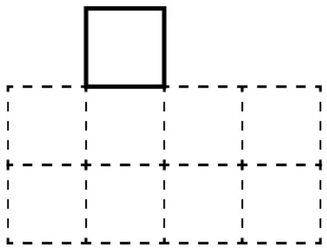

# 1-5 贪心总结

## P2240	部分背包问题

藏宝洞里面有 $N(N \le 100)$ 堆金币，第 $i$ 堆金币的总重量和总价值分别是 $m_i,v_i(1\le m_i,v_i \le 100)$。有一个承重量为 $T(T \le 1000)$ 的背包，但并不一定有办法将全部的金币都装进去。所有金币都可以随意分割，分割完的金币重量价值比（也就是单位价格）不变。请问最多可以拿走多少价值的金币？

### 思路

所有金币都可以分开, 也就是说只要按照性价比最高的取一定得到的价值最大.

## P1223	排队接水

有 $n$ 个人在一个水龙头前排队接水，假如每个人接水的时间为 $T_i$，请编程找出这 $n$ 个人排队的一种顺序，使得 $n$ 个人的平均等待时间最小。

### 思路

设顺序为 $T_1,\ldots , T_n$, 则总等待时间为

$$
nT_1+(n-1)T_2+\ldots+2T_{n-1}+T_n
$$

所以让时间短的先打水.

## P1803	凌乱的yyy / 线段覆盖

在一个数轴上有 n 条线段, 现要选取其中 k 条线段使得这 k 条线段两两没有重合部分，问最大的 k 为多少.

### 思路

右端点越左, 干扰右侧的线段越少. 因此可以按右端点升序排序, 然后按右端点贪心选择, 维护最后选择的线段的右端点.

## P1090	[NOIP2004 提高组] 合并果子 / \[USACO06NOV\] Fence Repair G

一共有 n 个数, 要求将这 n 个数合并, 合并的方法是两个数相加生成一个新的数, 重复这个过程直到最后剩余一个数. 单次合并的代价是两个数相加, 要求求出最小的总代价.

### 思路

希望让代价最小, 就需要让大数尽可能少相加, 就需要让大数晚相加.

这其实是 Huffman 树的问题。可以将这 n 个数构造为一棵二叉树，使得这些数都是叶子节点的权值，并且每个节点要么是叶子，要么有两个儿子。那么总代价就是所有叶子的权值乘以其到树根的路径长度之总和。

每一步合并都去合并最小的两个数，这样的方案是最优的。

证明: 

- 只有一个或两个数的时候显然算法正确。
- 设对于 k 个数算法也正确，考虑有 k+1 个数的时候。首先可以证明，对于任意最优解，最小数一定在最深的那一层，如果不然，就可以将最小数与最深的那一层的某个比它大的数交换，这样得到的总代价是更小的（因为权值乘以深度变小了），而显然在最深的层的节点是先合并的。而先合并完两个最小数之后，问题就转为 k 个数的情形了，接着由归纳假设，算法对于 k 个数的时候正确，再由数学归纳法，算法对于任意个数都正确。

```python
# python 的小根堆
from queue import PriorityQueue as PQ
pq = PQ()
# pq.put(x) pq.get() pq.empty()
```

## P3817	小A的糖果

一共有 n 个数, 要求相邻两个数的和不能大于 x, 求总共至少需要减去多少.

### 思路

首先如果单个数的和大于 x, 就单个数对应减法. 如果两个数的和大于 x, 应该减**后面**的, 因为后面的可以影响两个和, 减前面的只能影响一个和.

## P1106	删数问题

输入一个高精度的正整数 $N$（不超过 $250$ 位），去掉其中任意 $k$ 个数字后剩下的数字按原左右次序将组成一个新的非负整数，寻找一种方案使得剩下的数字组成的新数最小。

### 思路

删去升序的结尾, 或者删去降序的开头.

可以使用 `list.pop()` 方法实现删除.

## P1478	陶陶摘苹果

陶陶家的苹果树结了 $n$ 个果子。陶陶跑去摘苹果，他有一个 $a$ 公分的椅子。当他手够不着时，他会站到椅子上再试试。

陶陶之前搬凳子，力气只剩下 $s$ 了。每次摘苹果时都要用一定的力气。陶陶想知道在 $s<0$ 之前最多能摘到多少个苹果。

现在已知 $n$ 个苹果到达地上的高度 $x_i$，椅子的高度 $a$，陶陶手伸直的最大长度 $b$，陶陶所剩的力气 $s$，陶陶摘一个苹果需要的力气 $y_i$，求陶陶最多能摘到多少个苹果。

### 思路

对 $y_i$ 升序排序.

## P5019	\[NOIP2018 提高组\] 铺设道路

春春是一名道路工程师，负责铺设一条长度为 $n$ 的道路。 

铺设道路的主要工作是填平下陷的地表。整段道路可以看作是 $n$ 块首尾相连的区域，一开始，第 $i$ 块区域下陷的深度为 $d_i$ 。 

春春每天可以选择一段连续区间 $[L,R]$ ，填充这段区间中的每块区域，让其下陷深度减少 $1$。在选择区间时，需要保证，区间内的每块区域在填充前下陷深度均不为 $0$ 。 

春春希望你能帮他设计一种方案，可以在最短的时间内将整段道路的下陷深度都变为 $0$ 。

[类似题目: P1969 积木大赛](https://www.luogu.com.cn/problem/P1969)

### 思路

数据规模 $n\leq 1e5$, $h_i\leq 1e4$.

如果直接模拟每层填土的过程, 时间复杂度较高. 可以记录一个 i 表示从头到 i 的数都是 0, 这样下一次枚举从 i 开始即可.

也可以使用贪心的方法. 因为小的坑肯定会被大的坑带着填掉. 每当我们扫到一个数 $a[j]$ , 如果 $a[j-1] < a[j]$ 答案就加上差值. 即如果这个数比前一个数大, 那么在减前面的数时也顺便把这个数作减法. 如果 $a[j-1] \geq a[j]$ , 后面的数比前面的减得更早, 会造成区间分割, 无法再与后面的块连在一起.

如下图, 实际上代价是红色的段.


```c++
ans = 0
for(int i=1;i<=n;i++) cin>>a[i];
for(int i=2;i<=n;i++) if(a[i]>a[i-1]) ans += a[i]-a[i-1];
cout<<ans+a[1];
```

## P1208	\[USACO1.3\] 混合牛奶 Mixing Milk

Marry 乳业从一些奶农手中采购牛奶，并且每一位奶农为乳制品加工企业提供的价格可能相同。此外，就像每头奶牛每天只能挤出固定数量的奶，每位奶农每天能提供的牛奶数量是一定的。每天 Marry 乳业可以从奶农手中采购到小于或者等于奶农最大产量的整数数量的牛奶。

给出 Marry 乳业每天对牛奶的需求量，还有每位奶农提供的牛奶单价和产量。计算采购足够数量的牛奶所需的最小花费。

注：每天所有奶农的总产量大于 Marry 乳业的需求量。

### 思路

按照单价排序，单价小的在前面； 单价一样的就把产量多的放前面

## P1094	[NOIP2007 普及组] 纪念品分组

把购来的纪念品根据价格进行分组，但每组最多只能包括两件纪念品，并且每组纪念品的价格之和不能超过一个给定的整数，希望分组的数目最少。

### 思路

使分组最少且每组最多两个, 所以要尽可能的使每组的总价值接近上限. 由于最多每组选两个, 所以实际上不需要找两个总价值接近上限, 只需要一个放当前最大, 一个放当前最小 (放不下则最大的单独放) 即可.


## P4995	跳跳！

这一天，你和朋友小 F 一起出去玩耍的时候，遇到了一堆高矮不同的石头，其中第 $i$ 块的石头高度为 $h_i$，地面的高度是 $h_0 = 0$。你估计着，从第 $i$ 块石头跳到第 $j$ 块石头上耗费的体力值为 $(h_i - h_j) ^ 2$，从地面跳到第 $i$ 块石头耗费的体力值是 $(h_i) ^ 2$。

为了给小 F 展现你超级跳的本领，你决定跳到每个石头上各一次，并最终停在任意一块石头上，并且小跳蛙想耗费**尽可能多**的体力值。

### 思路

不难想到一个贪心, 即从最左（初始点）跳到最右, 再跳到第二左, 再跳到第二右. 证明如下:


## P4447	\[AHOI2018初中组\] 分组

### 题目描述

总共有 $n$ 个队员，每个人都有一个实力值 $a_i$。现在，把 $n$ 个队员分成若干个小组去参加这场比赛。

要求分成的每个小组的队员实力值连续，不能有两个实力相同的选手。举个例子 $[1, 2, 3, 4, 5]$ 是合法的分组方案，因为实力值连续； $[1, 2, 3, 5]$ 不是合法的分组方案，因为实力值不连续； $[0, 1, 1, 2]$ 同样不是合法的分组方案，因为出现了两个实力值为 $1$ 的选手。

要求一个合法的分组方案，满足所有人都恰好分到一个小组，使得人数最少的组人数最多，输出人数最少的组人数的最大值。

注意：实力值可能是负数，分组的数量没有限制。

对于 $100\%$ 的数据满足：$1\leq n\leq 100000$，$|a_i|\leq10^9$。

### 思路

from Wenoide

我们用类似条形统计图的方式，在数轴上统计各个实力值出现的次数。题目中的“分组”，就可以理解为在方格中画线。即被同一条线相连的方格所对应的同学被分为一组。如：


我们规定，删除被画过线的方格，且总是在最下方一行画线：


至此，“分组”问题被转化成了一个“俄罗斯方块”式的问题。接下来，我们要研究如何使人数最少的组别人数最大，也就是如何使长度最短的线长度最大。

令每一次画线都从最左边一列开始。每次都画到底，可以吗？

显然，大多数情况下这不是最优解。最后可能会剩下一个方块“一枝独秀”：



出现这种情况的根本原因是什么？我们发现，“一枝独秀”的方块总是出现在高度较高的几列。

我们需要改变画线的方式：如果右边一列的高度不低于当前列，则连接右边一列最下方的方块。反之，停止画线。这样，最靠左的一个“峰”相较其右边一列的高度差就不断减小，直到相同。如此反复。记录所画所有线的最短长度，即为答案。

```python
# P4447.py 3s

def setLast():
    global lastNum, lastPopu, sortList, i
    lastNum, lastPopu = sortList[i][0], sortList[i][1]
    sortList[i][1] -= 1

    if sortList[i][1] == 0:
        sortList.pop(i)
        if i >= len(sortList):  # 到末尾了
            resetLen(newLen=0)
    else:
        i += 1


def resetLen(newLen):
    global minLen, curLen, i
    minLen = min(minLen, curLen)
    curLen = newLen
    i = 0


MAXNUM = 100000
N = int(input())
ability = list(map(int, input().split()))

tinymap = {}
for item in ability:
    if tinymap.get(item) == None:
        tinymap[item] = 1
    else:
        tinymap[item] += 1

listKey = list(tinymap.keys())
listVal = list(tinymap.values())
tinyList = [[listKey[i], listVal[i]] for i in range(len(listKey))]
sortList = sorted(tinyList, key=lambda x: x[0])

curLen, minLen = 0, MAXNUM
i, lastNum, lastPopu = 0, 0, 0

while len(sortList) > 0:
    if minLen == 1:
        print("1")
        quit(0)

    if i >= len(sortList):
        resetLen(newLen=0)
    # 队列的第一个
    elif curLen == 0:
        curLen = 1
        setLast()
    # 可以加入队列的条件:
    # 1. 连续 2. 前一个人数 <= 后一个人数
    elif lastNum + 1 == sortList[i][0] and lastPopu <= sortList[i][1]:
        curLen += 1
        setLast()
    else:
        resetLen(newLen=0)


# minLen = min(minLen, curLen)
print(minLen)
```

这样写的常数巨大, 因为 `dict` 不保证有序, 对列表做了很多删除操作. 找到了一份 1s 的代码如下. 这份代码与刚才的思路类似, 也是升序放进一个队伍, 但是不同点在于只扫描了每个 key 一次, 然后对每个 key 后满足条件的元素做操作, 暂时没有想到证明的方法.

```python
from collections import Counter
def LI_():
    return list(map(int, input().split()))
def I_():
    return int(input())
if __name__ == "__main__":
    n = I_()
    a = LI_()
    c = Counter(a)
    ans = n
    for k in sorted(c.keys()):
        if c[k] == 0:
            continue
        # else: while c[k] > 0: 
        # 再做下面的操作, 就和上面的代码思路相同
        x = k
        while c[x + 1] >= c[x]:
            c[x] -= 1
            x += 1
        c[x] -= 1
        ans = min(ans, x - k + 1)
    print(ans)
```

事实上, 本题还可以用二分的方法解决. 首先对实力值排序. 然后维护两个数组: `siz` 表示每个组的大小; `q[x]` 表示第 x 组要想继续添加成员所需要的实力值. 很显然每次加入一个成员后要将 `q[i]++`. 

怎么找 i 呢? 通过二分查找 `bisect` , 可以找到与当前成员实力值相等的组. 找到后判断是否和当前成员实力值相等, 相等则更新 q 数组, 否则在 q 中就找不到该值，需要开一个新的组. 还需判断是否超过总组数.

```python
from bisect import bisect


MAXNUM = 100000
N = int(input())
a = list(map(int, input().split()))
a.sort()

# team = [[下一个队员的实力, 目前人数]]
# team 在构造的过程中肯定是升序的
team = [[a[0] + 1, 1]]
for x in a[1:]:
    i = bisect(team, x, key=lambda x: x[0])
    i -= 1
    if i < 0:
        team.append([x + 1, 1])
    elif team[i][0] != x:  # 当前的队伍都放不了
        team.append([x + 1, 1])
    else:
        team[i][0] = x + 1
        team[i][1] += 1

ans = min(team, key=lambda x: x[1])
print(ans[1])

```

## P1080	\[NOIP2012 提高组\] 国王游戏

恰逢 H 国国庆，国王邀请 $n$ 位大臣来玩一个有奖游戏。首先，他让每个大臣在左、右手上面分别写下一个整数，国王自己也在左、右手上各写一个整数。然后，让这 $n$ 位大臣排成一排，国王站在队伍的最前面。排好队后，所有的大臣都会获得国王奖赏的若干金币，每位大臣获得的金币数分别是：排在该大臣前面的所有人的左手上的数的乘积除以他自己右手上的数，然后向下取整得到的结果。

国王不希望某一个大臣获得特别多的奖赏，所以他想请你帮他重新安排一下队伍的顺序，使得获得奖赏最多的大臣，所获奖赏尽可能的少。注意，国王的位置始终在队伍的最前面。

### 思路

[@savage的题解](https://blog.nowcoder.net/n/2b45bc29a7fd454b8edd60e34d7ac991)

根据题意我们可以知道，大臣1和大臣2位置能交换的必要条件是：大臣2放在大臣1的前面得到的最大值更加小。那么我们分别讨论两种情况下的最大值，假设只有两个大臣：

如果大臣1放在前面，他俩获得的金币数分别为 $a_0/b_1$, $a_0*a_1/b_2$

如果大臣2放在前面，他俩获得的金币数分别为： $a_0/b_2$, $a_0*a_2/b_1$

不妨约去式子里面的 $a_0$，然后分别讨论两种情况的最大值，就变成了比较： $max(1/b_1,a_1/b_2)$ 和 $max(1/b_2,a_2/b_1)$ 的大小。

令 $max(1/b_1,a_1/b_2) < max(1/b_2,a_2/b_1)$ ，这对应着 大臣1 在前的最大值 比 大臣2 在前的最大值要小。那么这样的假设需要满足什么条件呢？

首先我们已知 $a_1/b_2 \geq 1/b_2$ 且 $a_2/b_1 \geq 1/b_1$。不妨假设 $a_1/b_2 \geq a_2/b_1$，那么有 $a_1/b_2 \geq a_2/b_1$ 且 $a_1/b_2 \geq 1/b_2$，与 $max(1/b_1,a_1/b_2) < max(1/b_2,a_2/b_1)$ 矛盾。

所以 $a_1/b_2 \leq a_2/b_1$，即如果 大臣1 在前则需要满足 $a_1 b_1 \leq a_2 b_2$。