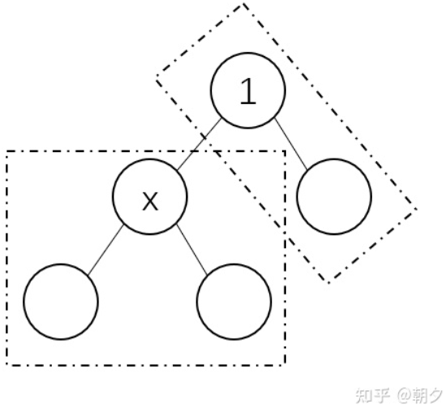
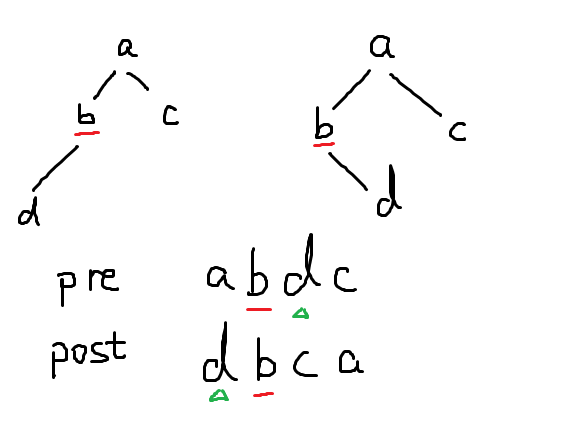
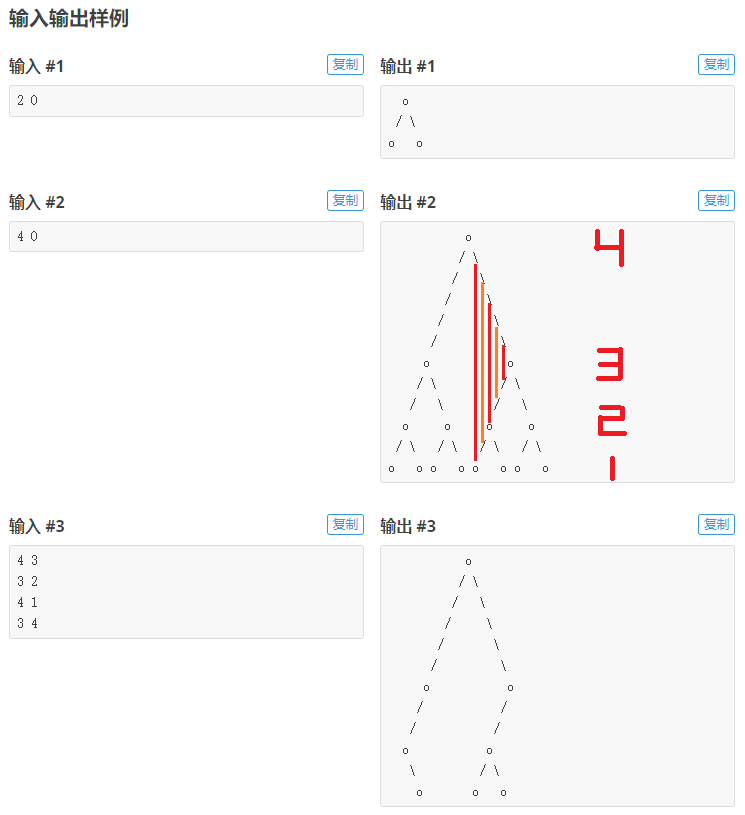

# 2-2 二叉树总结

## P4715	【深基16.例1】淘汰赛

有 $2^n$（ $n\le7$ ）个国家参加世界杯决赛圈且进入淘汰赛环节。已经知道各个国家的能力值，且都不相等。能力值高的国家和能力值低的国家踢比赛时高者获胜。1 号国家和 2 号国家踢一场比赛，胜者晋级。3 号国家和 4 号国家也踢一场，胜者晋级……晋级后的国家用相同的方法继续完成赛程，直到决出冠军。给出各个国家的能力值，请问亚军是哪个国家？

### 思路

- 直接对列表排序后取第二个最大的思路不正确, 因为可能第二个最大的在决赛之前就碰到了最大的被淘汰.
- 除了用二叉树或递归的方式直接模拟, 实际上分析可得只需对列表分成前半和后半, 然后分别排序后取最大, 比较出第二大即为答案.

## P4913	【深基16.例3】二叉树深度

有一个 $n(n \le 10^6)$ 个结点的二叉树。给出每个结点的两个子结点编号（均不超过 $n$），建立一棵二叉树（根节点的编号为 $1$），如果是叶子结点，则输入 `0 0`。

建好这棵二叉树之后，请求出它的深度。二叉树的**深度**是指从根节点到叶子结点时，最多经过了几层。

### 思路

先建树, 然后用 BFS 或 DFS 搜索深度. 注意 `python` 递归深度默认只有 $996$ , 需要手动设置递归深度:

```python
import sys
sys.setrecursionlimit(limit)
```

## P1827	[USACO3.4] 美国血统 American Heritage

给定前序遍历和中序遍历, 求后序遍历

### 思路

二叉树遍历顺序: 前序遍历根左右; 中序遍历左根右; 后序遍历左右根.

所以给定前序 `pre` 和中序 `inor`, 可以先根据前序 `pre` 的第一位找到根节点 `root`, 然后在中序 `inor` 中找到 `root` 的位置, 左侧节点构成左子树, 右侧节点构成右子树, 然后分别继续递归即可.

```c++
string pre,inor;
void work(string pre,string inor)
{
    if(pre.empty())return;
    //如果序列空了，就没必要继续了
    char root=pre[0];
    //取到前序序列的首字母，即根节点
    int k=inor.find(root);
    //找到中序序列中根节点的位置
    pre.erase(pre.begin());
    //删去前序序列中的根节点
    string leftpre=pre.substr(0,k);
    //从0开始切割k个
    string rightpre=pre.substr(k);
    //从k开始切割到最后
    string leftinor=inor.substr(0,k);
    //从0开始切割k个
    string rightinor=inor.substr(k+1);
    //从k+1开始切割到最后
    work(leftpre,leftinor);
    work(rightpre,rightinor);
    printf("%c",root);
    //因为要输出后序序列，所以是左右根
    //先遍历左子树，再右子树，再根节点
}
int main()
{
    cin>>inor>>pre;
    work(pre,inor);
    putchar('\n');
    return 0;
}
```
如果需要建树, 则递归返回 `root` 节点, 父节点的儿子指向 `root` 节点. 如果节点数较多, 可以做一个哈希映射, 帮助我们快速定位根节点. [Leetcode 105](https://leetcode.cn/problems/construct-binary-tree-from-preorder-and-inorder-traversal/solutions/255811/cong-qian-xu-yu-zhong-xu-bian-li-xu-lie-gou-zao-9/)

```python
# 构造哈希映射，帮助我们快速定位根节点
index = {element: i for i, element in enumerate(inorder)}
```

## P5076	【深基16.例7】普通二叉树（简化版）

要求实现一个 BST, 操作有插入和查询前序, 后继, 第 k 个. 其实与 [P2234](../2-1_linearList/readme.md/#p2234-hnoi2002-营业额统计) 差不多.

## P1364	医院设置

设有一棵二叉树，如图：


其中，圈中的数字表示结点中居民的人口。圈边上数字表示结点编号，现在要求在某个结点上建立一个医院，使所有居民所走的路程之和为最小，同时约定，相邻接点之间的距离为 $1$。如上图中，若医院建在 $1$ 处，则距离和 $=4+12+2\times20+2\times40=136$；若医院建在 $3$ 处，则距离和 $=4\times2+13+20+40=81$。

对于 $100\%$ 的数据，保证 $1 \leq n \leq 100$，$0 \leq u, v \leq n$，$1 \leq w \leq 10^5$ 。

### 思路 1. 搜索

由于数据小, 所以可以直接用搜索的方式求解. 解法是对每个点都搜一次, 搜的过程中记录深度, 距离为当前点的权值乘以深度, 然后对每个点搜索的结果取最小答案. 时间复杂度 $O(n^2)$.

### 思路 2. Floyd

使用 Floyd 可以求出任意两点之间的距离, 实际上就是记录了任意点做根时任一点的深度. 然后枚举所有节点为根, 将当前节的权重乘以深度 (该点到根节点的距离) 即可. 时间复杂度 $O(n^3)$.

### 思路 3. 带权树的重心

首先我们知道树的重心有一些良好的[性质](https://zhuanlan.zhihu.com/p/357938161), 根据重心的定义, 我们可以写出找无权树的重心的[代码 from oiwiki](https://oi-wiki.org/graph/tree-centroid/).

```c++
// 这份代码默认节点编号从 1 开始，即 i ∈ [1,n]
int size[MAXN],    // 这个节点的「大小」（所有子树上节点数 + 该节点）
    weight[MAXN],  // 这个节点的「重量」，即所有子树「大小」的最大值
    centroid[2];   // 用于记录树的重心（存的是节点编号）

void GetCentroid(int cur, int fa) {  // cur 表示当前节点 (current)
  size[cur] = 1;
  weight[cur] = 0;
  for (int i = head[cur]; i != -1; i = e[i].nxt) {
    if (e[i].to != fa) {  // e[i].to 表示这条有向边所通向的节点。
      GetCentroid(e[i].to, cur);
      size[cur] += size[e[i].to];
      weight[cur] = max(weight[cur], size[e[i].to]);
    }
  }
  weight[cur] = max(weight[cur], n - size[cur]);
  if (weight[cur] <= n / 2) {  // 依照树的重心的定义, 也可以最大的子树节点最少
    centroid[centroid[0] != 0] = cur;
  }
}
```

那么[有权树的重心](https://blog.csdn.net/zstuyyyyccccbbbb/article/details/108952302)怎么求呢?

- 边权：其实和所有边为单位 1 的重心**一模一样**, 没有找到证明方式, 但画个图其实发现边权无法影响重心位置
- 点权：把**最大的子树节点数**最少改成**最大点权块**最小

于是我们只需要先 dfs 一次, 求出有权树的重心, 然后从重心再 dfs 一次求路径即可.

```python
def center(fa, u):
    # size[u]: 以 1 为根, u 的树点权 = 当前点权 + 子树的点权
    # ith edge = [to, weight, nextEdgeIndex]
    size[u] = cow[u]

    i = head[u]
    while i != -1:
        if edge[i][0] != fa:
            center(u, edge[i][0])
            size[u] += size[edge[i][0]]
            maxSize[u] = max(maxSize[u], size[edge[i][0]])
        i = edge[i][2]
    
    # 计算最大点权块
    maxSize[u] = max(maxSize[u], totalCow - size[u])


def dfs(fa, u):
    i = head[u]
    while i != -1:
        if edge[i][0] != fa:
            dis[edge[i][0]] = dis[u] + edge[i][1]
            dfs(u, edge[i][0])
        i = edge[i][2]

# 随便找一个节点 dfs 一次找重心
center(1, 1)

# 选最大点权块最小的点 minIndex, 然后再 dfs 一次计算路径, 最后由边权和点权计算代价.
...
dfs(minIndex, minIndex)
...

```

### 思路 4. 换根 DP

带权树的重心只能解决部分问题, 我们来看一看如何使用更为通用的 [换根 DP @朝夕](https://zhuanlan.zhihu.com/p/348349531) 解决这类问题.

换根DP，又叫二次扫描，是树形DP的一种。其相比于一般的树形DP具有以下特点:

- 以树上的不同点作为根，其解不同。
- 故为求解答案，不能单求某点的信息，需要求解每个节点的信息。
- 故无法通过一次搜索完成答案的求解，因为一次搜索只能得到一个节点的答案。
- 关键是在求出一个根的答案后, 得到从根到其他点的递推公式。

对于这道题的思路是:

- 如果要暴力求解出最优解，则我们可以枚举所有的节点为根，然后分别跑一次搜索，这样的时间复杂度会达到 $O(n^2)$ ，显然不可接受。
- 所以我们考虑在第二次搜索时就完成所有节点答案的统计。假设第一次搜索时的根节点为 1 号节点，则此时只有 1 号节点的答案是已知的。同时第一次搜索可以统计出**所有子树的大小**。
- 第二次搜索依旧从 1 号节点出发，若 1 号节点与节点 x 相连，则我们考虑能否通过 1 号节点的答案去推出节点x的答案。
- 我们假设此时将根节点换成节点 x ，则其子树由两部分构成，第一部分是其原子树，第二部分则是 1 号节点的其他子树（如下图）。根从 1 号节点变为节点 x 的过程中，我们可以发现第一部分的深度降低了 1 ，第二部分的深度则上升了 1 ，而这两部分节点的数量在第一次搜索时就得到了。
- 故得到递推公式

$$ f[v] = f[u] - size[v] * w_{uv} + (size[1] - size[v]) * w_{uv} $$



双倍经验: 
- [CF 1092F Tree with Maximum Cost](https://www.luogu.com.cn/problem/CF1092F)
- [POI 2008 STA-Station](https://www.luogu.com.cn/problem/P3478)
- [[USACO10MAR] Great Cow Gathering G](https://www.luogu.com.cn/problem/P2986)

## P1229	遍历问题

给定一棵二叉树的前序和后序遍历, 求可能的中序遍历序列的总数.

### 思路

在二叉树中, 如果一个节点只有一个儿子, 那么这个儿子在左或在右, 整个子树的前序和后序遍历都是相同的. ( 原因: 给定中能确定树的具体结构，是因为可以确定是左子树还是右子树，而之给定前和后，则不能确定，这就是会出现不同树结构的原因。 ) 

这样的节点每多一个, 总树数就要乘 2. 所以实际上是找只有一个儿子的节点数量. 对于前序, 如果一个结点的下个结点等于后序对应结点的前一个结点的话, 那么这个结点就只有一个子树.



```python
ans = 1
for i in range(N - 1):  # 最后一个肯定没有儿子
    j = post.find(pre[i])
    if j > 0 and post[j - 1] == pre[i + 1]:
        ans = ans << 1
```

## P1305	新二叉树

输入一串二叉树，输出其前序遍历。深搜题。

## P1030	[NOIP2001 普及组] 求先序排列

已知中序遍历和后序遍历, 求先序遍历. 和 P1827 一样的思路.

## P3884	[JLOI2009] 二叉树问题

求一棵二叉树的深度（找最深的节点）、宽度（找节点最多的一层）和两个节点之间的距离。

### 思路

深度、宽度使用 DFS 即可求解。两点之间的距离可以使用 $O(n^3)$ 的 Floyd 算法，也可以通过 最近公共祖先（[LCA](https://oi-wiki.org/graph/lca/)） 求解。这里我们使用倍增求 LCA, 然后用LCA 得到答案。

LCA 相关学习资料

- [视频解释使用倍增算法解 LCA](https://www.bilibili.com/video/BV1N7411G7JD/) 
- [倍增和 Tarjan 实现 LCA](https://www.cnblogs.com/TEoS/p/11376616.html)

在建完边之后就可以使用倍增法求 LCA 了, 首先需要初始化倍增数组 f.

```python
# 对 f 数组进行递推, 步骤:
# 1. 根节点入队, 存储深度 d
# 2. 取出队头, 遍历所有出边 (跳过父亲的边) , 处理出边的点的 d 和 f ,
#    其中 f[i][j] = f[ f[i][j-1] ][j-1]
# 3. 重复第 2 步直到队空
def bfsPreprocess():
    q = deque()
    # 1 号节点为根
    q.append(1)
    depth[1], width[1] = 1, 1
    while len(q) > 0:
        x = q.popleft()
        i = head[x]
        while i != -1:
            y = edge[i].to
            # 如果该点已经被遍历过 (父亲节点) 就跳过
            if depth[y] == 0:
                depth[y] = depth[x] + 1
                width[depth[y]] += 1
                f[y][0] = x
                # 更精确的, 应该是 0 ~ int(log2(depth[y] - depth[root])) + 1
                # 跳过头的结果都是 0
                for j in range(1, lgn + 1):
                    f[y][j] = f[f[y][j - 1]][j - 1]
                q.append(y)
            i = edge[i].next
```

然后使用二进制拆分求 LCA.

```python
# 求出两点 x, y 之间的 LCA, 步骤:
# 1. 先让 d[x] < d[y], 如果不是就先交换
# 2. 让 y 上移 (二进制拆分) 到与 x 相同的深度,
#    若此时 x = y 就说明 LCA(x,y) = 当前节点
# 3. 再用二进制拆分把 x 和 y 同时上移, 并且保证 x != y.
#    完成该步后, x 和 y 一定在某个节点的两个子节点上,
#    因此 LCA(x,y) = 他们的父亲节点
def lca(x, y):
    if depth[x] > depth[y]:
        x, y = y, x
    # 从 logn 到 0 上移
    for i in range(lgn, -1, -1):
        if depth[f[y][i]] >= depth[x]:
            y = f[y][i]
    if x == y:
        return x
    for i in range(lgn, -1, -1):
        if f[x][i] != f[y][i]:
            x, y = f[x][i], f[y][i]
    return f[x][0]
```

由于题目中向根的边权是 2, 向叶的边权是 1, 所以最后两点之间的距离可以用 

$$2 * (depth[x] - depth[ansestor]) + (depth[y] - depth[ansestor])$$ 

得到.

## P1185	绘制二叉树



一个比较麻烦的画图题. 首先需要找规律得到树枝的长度, 然后需要得到每一层节点的位置.
