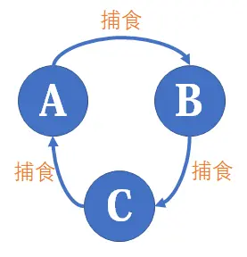
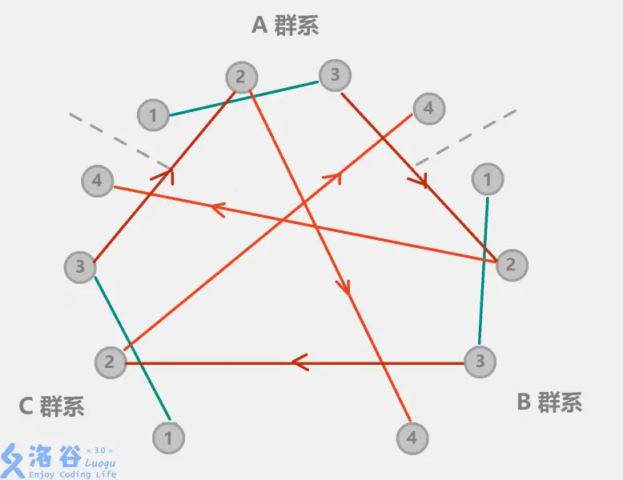

# 2-3 集合总结

## P1551	亲戚

给出某个亲戚关系图，求任意给出的两个人是否具有亲戚关系。

规定 $x$ 和 $y$ 是亲戚，$y$ 和 $z$ 是亲戚，那么 $x$ 和 $z$ 也是亲戚。如果 $x$，$y$ 是亲戚，那么 $x$ 的亲戚都是 $y$ 的亲戚，$y$ 的亲戚也都是 $x$ 的亲戚。

### 思路

[并查集 @oiwiki](https://oi-wiki.org/ds/dsu/) 模板题。并查集是一种用于管理元素所属集合的数据结构，实现为一个森林，其中每棵树表示一个集合，树中的节点表示对应集合中的元素。本题要求实现两种操作，合并和查询。

```python
class Dsu:
    # 初始时，每个元素都位于一个单独的集合，表示为一棵只有根节点的树。
    # 方便起见，将根节点的父亲设为自己。
    def __init__(self, size):
        self.pa = list(range(size))
        self.size = [1] * size

    # 要合并两棵树，只需要将一棵树的根节点连到另一棵树的根节点。
    # 合并时，选择哪棵树的根节点作为新树的根节点会影响未来操作的复杂度。
    # 可以将节点较少或深度较小的树连到另一棵，以免发生退化。
    def union(self, x, y):
        x, y = self.find(x), self.find(y)
        if x == y:
            return
        if self.size[x] < self.size[y]:
            x, y = y, x
        self.pa[y] = x
        self.size[x] += self.size[y]
    
    # 查询需要沿着树向上移动，直至找到根节点。
    # 由于查询过程中经过的每个元素都属于该集合，
    # 可以将其直接连到根节点以加快后续查询。（路径压缩）
    def find(self, x):
        if self.pa[x] != x:
            self.pa[x] = self.find(self.pa[x])
        return self.pa[x]
```

## P1536	村村通

并查集应用题，计算一个图中加几个边可以全联通。

在 `union` 操作完成后计算有多少个 `x == find(x)` 的点（联通子块数量），记作 `num`，答案为 `num-1`。

## P3370	【模板】字符串哈希

给几个字符串，判断里面有多少个字符串是不一样的

### 思路

1. 使用 dict
2. 使用 hash

## P3405	\[USACO16DEC\] Cities and States S

## P5250	【深基17.例5】木材仓库

## P5266	【深基17.例6】学籍管理

## P1102	A-B 数对

## P1918	保龄球

## P1525	[NOIP2010 提高组] 关押罪犯

## P1621	集合

## P1892	\[BOI2003\] 团伙

## P1955	\[NOI2015\] 程序自动分析

## P4305	\[JLOI2011]\ 不重复数字

## P3879	\[TJOI2010\] 阅读理解	

## P2814	家谱

# 扩展题

在做并查集的题目时，还有一些比较经典的题目，如下。

## P2024    \[NOI2001\] 食物链

动物王国中有三类动物 $A,B,C$，这三类动物的食物链构成了有趣的环形。$A$ 吃 $B$，$B$ 吃 $C$，$C$ 吃 $A$。

现有 $N$ 个动物，以 $1 \sim N$ 编号。每个动物都是 $A,B,C$ 中的一种，但是我们并不知道它到底是哪一种。

有人用两种说法对这 $N$ 个动物所构成的食物链关系进行描述：

- 第一种说法是 `1 X Y`，表示 $X$ 和 $Y$ 是同类。
- 第二种说法是 `2 X Y`，表示 $X$ 吃 $Y$。

此人对 $N$ 个动物，用上述两种说法，一句接一句地说出 $K$ 句话，这 $K$ 句话有的是真的，有的是假的。当一句话满足下列三条之一时，这句话就是假话，否则就是真话。

- 当前的话与前面的某些真的话冲突，就是假话；
- 当前的话中 $X$ 或 $Y$ 比 $N$ 大，就是假话；
- 当前的话表示 $X$ 吃 $X$，就是假话。

你的任务是根据给定的 $N$ 和 $K$ 句话，输出假话的总数。



### 思路

本题不仅要维护动物之间的种类，还需要维护捕食的关系。适合使用种类并查集。[@Sooke的题解](https://www.luogu.com.cn/article/1a654mcf)，[@Pecco关于种类并查集的总结](https://zhuanlan.zhihu.com/p/97813717)。[@ElevenQian关于并查集的总结](https://www.cnblogs.com/Eleven-Qian-Shan/p/13154721.html)
- 要求判断假话的个数，即判断两种说法的真假（两个动物是同类、两个动物的捕食关系）
- 对于 x 和 y 是同类动物，用并查集查 `find(x) == find(y)` 即可。
- 对于 x 捕食 y，因为我们并不知道 x 或 y 是属于 A B C 中哪个种类，所以我们可以用一个三倍大小的并查集进行维护，用 $i+n$ 表示 $i$ 的捕食对象，而 $i+2n$ 表示 $i$ 的天敌。
- 所以如果是同类，就维护 `union(x, y), union(x+n, y+n), union(x+2n, y+2n)`；如果是捕食，就维护 `union(x, y+n), union(x+n, y+2n), union(x+2n, y)`；判断捕食关系，可以通过 `find(x) == find(y+n)`。
- 这样，我们实际上在边权上维护了**模 3 意义下的加法群**。

比如对于输入

```
4 5
1 1 3
2 2 4
2 3 2
1 1 4
2 2 1
```

对于前三句话，我们可以建立出这样的关系



然后由于 A 群中的 4 和 B 群中的 1 在一个集合，所以第四句话是假的。由于 A 群中的 2 和 C 群中的 1 在一个集合，所以第五句话是假的。